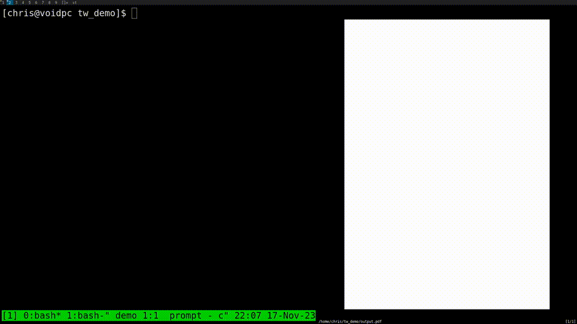

# Typewriter

Convert text to PDF.



## Whats Great

* Great for printing raw text files.
* Automatic 'smart' page breaking.
* Supports images.
* Easy to create your own formatter.
* No external libraries.

## Whats not Great

* Does not support unicode characters.
* Only supports Baseline JPEG images.
* Only built-in PDF fonts are supported.

## Examples

```bash
# Make a PDF calendar.
cal -y | tw-raw -o calendar.pdf

# Print a git diff.
git diff | tw-raw -o changes.pdf

# Make a pdf with an image.
cat | tw-image -o document.pdf << EOF
Below this line of text, there is an image:
!IMAGE my_image.jpg
The image is above this line of text.
EOF
```
## Installation

```bash
make
sudo cp tw-raw /usr/bin/tw-raw
sudo cp tw-image /usr/bin/tw-image
```

## Usage

There are currently two binaries provided: `tw-raw` and `tw-image`.

`tw-raw` reads ASCII text from standard input, and writes it to a PDF file
specified by the `-o` option or `output.pdf` by default. A PDF built-in
monospace font is used. New pages are created as required. There are no special
escape characters for formatting.

`tw-image` reads ASCII text from standard input. Lines of the form
`!IMAGE image.jpg` will insert the baseline JPEG image into the page at this
location. The image is scaled so that the width spans the page width minus
margins. Page breaks are automatically selected. Lines of the form `---`
indicate a good location for a page break, the dashes are not written to the
PDF. `tw-image` will prefer inserting page breaks on empty lines than inbetween
non-empty lines.

## Write your own `tw-*` Formatter

Create a new file in this directory named `tw-formatter.c`, replacing
`formatter` with your desired name. Use `tw-raw.c` and `tw-image.c` as a
reference when writing your formatter. Next time you run `make`, your new
formatter will be detected, and `tw-formatter` (or whatever) will be built.

Building your own formatters is encouraged. And its fairly easy due to the
small, self-contained codebase.

## License

GPLv3.
See "LICENSE" for details.
